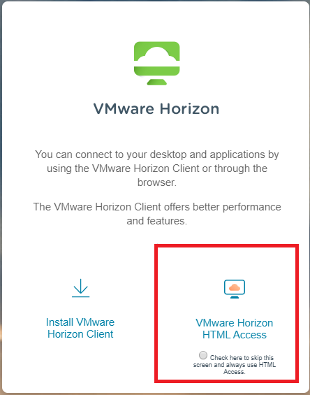
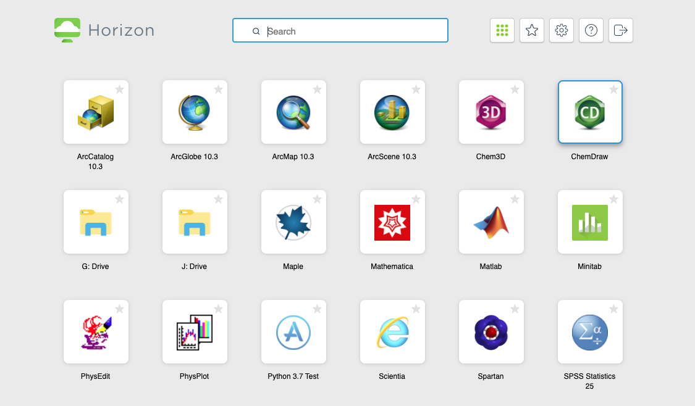
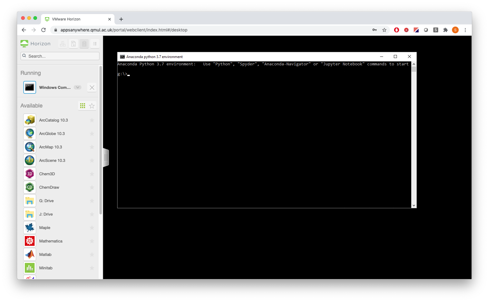

---
title: "GEG6230 - AppsAnywhere and Python"
author: Stuart Grieve
...

# GEG6230 - AppsAnywhere and Python

In order to load the same version of python from home that you had access to in class, we are going to use the AppsAnywhere service. This service allows you to load a range of programs, running on university computers, via your web browser.

For full instructions on using AppsAnywhere see the university's help pages:

https://www.its.qmul.ac.uk/services/students/appsanywhere/

and follow the instructions under the heading `Accessing Appsanywhere through the web`.

## Loading a Jupyter Notebook using AppsAnywhere

1. Go to https://appsanywhere.qmul.ac.uk/ and click on the HTML access button.

 <!-- .element width="80%" -->

This will prompt you to log in using your QMUL login details.

2. Once you are logged in, you will see a selection of different apps that you can run:

 <!-- .element width="80%" -->

3. Click on the App called either `Python 3.7 Test` or `Python 3.7`.

4. After a few seconds, a black python window will open as shown below:

 <!-- .element width="80%" -->

5. In this window, type the command `jupyter notebook` and press `enter`.

6. This will launch a Jupyter Notebook as used in class, and all of the original class materials can be followed as normal within this environment.
