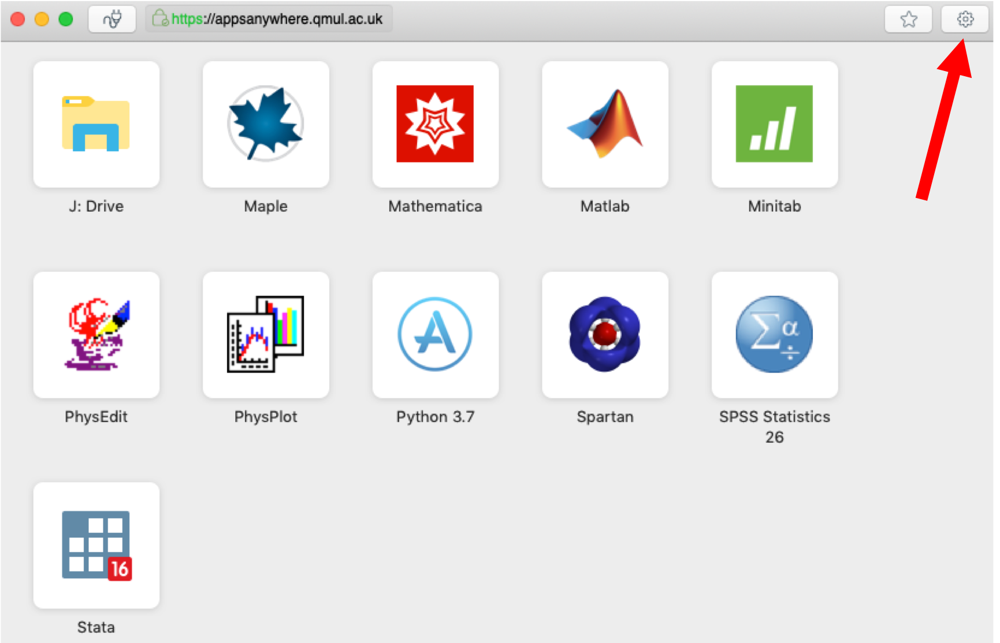

# Fixing your keyboard layout in AppsAnywhere

If you have an international keyboard layout (e.g. German, French), you may find that when working in the AppsAnywhere environment, the keys you press on your keyboard result in different characters appearing in your programs running inside AppsAnywhere.

## Solution

1. Connect to AppsAnywhere as normal using the VMware Horizon Client
2. Click on the settings button in the top right of the window:

 <!-- .element width="80%" -->

3. Select the option `Extend the local IME to hosted applications`:

 <!-- .element width="80%" -->

4. Close the settings window and continue working as normal

The above screenshots are taken from the MacOS version of the software, but the same options are available in the Windows version as well. Currently the Chromebook version of VMWare Horizon does not seem to support these options.
