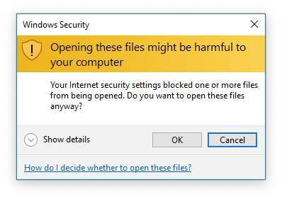
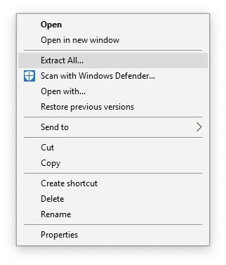
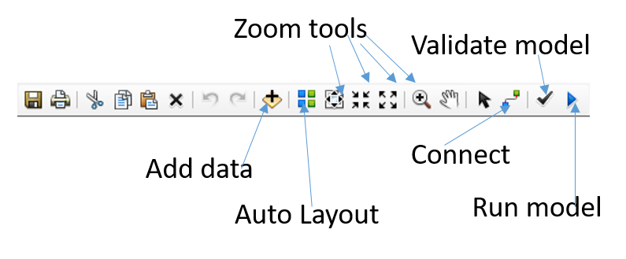

---
title: "GEG6230 Introduction to ModelBuilder"
author: Stuart Grieve
urlcolor: blue
colorlinks: true
...

# Introduction to ModelBuilder

## Aims and Objectives

In this practical you will be introduced to the ModelBuilder tool in ArcGIS, and will use it to build two geoprocessing workflows.

By the end of this class you should be able to:

1. Translate conceptual models of workflows into ModelBuilder
1. Use a range of ArcGIS tools to build complex models
1. Save models as custom toolboxes
1. Load and edit saved toolboxes

## Downloading the data

This practical, and the work in Week 8 and 9 all use the same data, which can be downloaded from the `Week 6` section on QMplus. 

## Extracting the data

Once the zip file has been downloaded and copied to a folder in your `G: Drive`, you can extract it by right clicking on the downloaded zip file. This will pop up a warning, which you can click `Ok` to:

 <!-- .element width="80%" -->

Select `Extract All` in the right click menu:

 <!-- .element width="80%" -->

This will complete after a few seconds, and you will be able to see all of your data files in the folder that has been created:

 <!-- .element width="80%" -->

**Remember to put your data in a sensible folder that does not have any spaces in the file name.**

## Building our first model

The first model we will be building will be a solution to our in-class exercise of identifying trees near a road and lake. To recap our requirements, we need to identify all trees that are within 300 meters of the lake and 400 meters of the road. For this model, we will be using the following files:

- `road.shp`
- `trees.shp`
- `field.shp`
- `lake.shp`

### Loading ModelBuilder

Load ArcMap as normal, and create a new blank map document. Launch the ModelBuilder by selecting 'Geoprocessing > ModelBuilder' from the menu at the top of the screen. After a few seconds the following window will pop up:

 <!-- .element width="80%" -->

This window has some familiar buttons and some new ones:

 <!-- .element width="80%" -->

### Building our model

Now that we have familiarised ourselves with the options available to us, lets add some data using the ModelBuilder `Add Data` button. Click this button and load `road.shp` and `lake.shp`. This will load the data as 2 blue ovals - this is how data is represented in ModelBuilder.

We can now add our first GIS tool from the `ArcToolbox`. We can do this simply by dragging and dropping a tool from the toolbox into the ModelBuilder window. We need to find all of the trees within a distance of an object, so lets create a buffer. We can find the buffer tool under `ArcToolbox > Analysis Tools > Proximity > Buffer`.

Once we have added a tool it needs to be connected to some data, use the `Connect` tool to link between `road.shp` and the buffer tool by clicking on each of them in turn, and selecting `Input Features` when prompted. Now double click on the buffer tool, choose a sensible place to store the output, and set the distance to `400 meters`. Click OK, and when you return to the main ModelBuilder window, the tool will have turned yellow, and its output green.

Repeat this process with a second buffer tool, this time connected to `lake.shp`, with a buffer distance of `300 meters`. Your model should now look similar to this:

 <!-- .element width="80%" -->

We can use the `Intersect` tool to find the intersection between the two buffered polygons: this will give us the area that is within the two distances of our features of interest. The Intersect tool can be found in `ArcToolbox > Analysis Tools > Overlay > Intersect`, drag and drop it into the ModelBuilder window and connect the two outputs from the buffer tools as inputs.

The final stage is then to select all of the trees within this intersection and create a new shapefile containing only the selected trees. Add in the `Select Layer by Location` tool (`ArcToolbox > Data Management Tools > Layers and Table Views > Select Layer by Location`) again by dragging and dropping it into the model. Don't connect anything to it directly, instead double click on it and choose the following options:

- Input Feature Layer: `trees.shp`
- Relationship: `WITHIN`
- Selecting Features: The output from the intersect tool

Leave everything else as its default and click `OK`. It should now be connected up and colored yellow.

Now add the `Copy Features` tool (`ArcToolbox > Data Management Tools > Features > Copy Features`) to the model, connect the output of the `Select Layer by Location` tool to it, double click on it and set a sensible place for the final result of the model to be saved. Your finished model should look something like:

 <!-- .element width="80%" -->

### Running a model

To run a model, first click `Validate` to check for any common errors (missing files, broken connections) and then click on the `Run` button, this will launch a window showing the progress of your model, once it has completed, you can return to the main ArcMap window and load the results of the model to see if it has worked.

### Tidying up

Once you have done all this, your model may be a bit messy, click the `Auto Layout` button to tidy things up. You should also make sure that all of the input and output names make sense, you will need to change at least some of them by right clicking on an element of the model and selecting `Rename`. You can also add labels to the model using the `Insert` menu. **This is very important in helping others understand your model.**

## Saving a model

Now that we have made a model, we will want to save it so that we can use it again and share it with others. To do this, click the save button, which will launch a save window. However, we cannot just save our model anywhere, it must be saved within a `Toolbox`. Navigate to where you wish to save your model, and click the `New Toolbox` button on the top right of the save window. Give this toolbox a descriptive name and double click on it. We can now choose a name for our new model, and click save.

## Exporting a model image

It is often useful to be able to export an image of our model to include in a report. This can be done in the `Model` menu `Model > Export > To Graphic`. We can choose a `.png` file if we just need a quick image, but if we want to be able to edit the file in Inkscape, we need to select `Enhanced Metafile (*.emf)`, as this can be loaded by Inkscape.

## Loading a model

If we wish to return to a previously saved model, we need to load the toolbox we saved it in. To do this, right click on the ArcToolbox and choose `Add Toolbox...`, navigate to where you saved your toolbox, select it and click `Open`. This will add your toolbox alongside all of the built in toolboxes that come with ArcMap. Open your toolbox and you will see your model!

To reopen your model in ModelBuilder, right click on the model and click `Edit`. **There is a bug in ArcMap that means that the ModelBuilder window will load off the side of the screen. Press the windows key and the left arrow to move it into view.** You may also need to use the zoom tools to reset the zoom to something sensible.

## A more complex model

Now that we have figured out the basics of building and using a model, we are going to build a new model to calculate the stream power at the outlet of a series of catchments. To do this we will use the following data, downloaded earlier in this practical:

- `catchment_1.shp` through `catchment_4.shp`
- `Slope.tif`

**Some of the steps we will be taking will edit the catchment shapefiles so it is a good idea to make a copy of these as a backup in case things go wrong.**

The aim of our new model is to calculate the stream power, $E$, which is an approximate measure of the rate of fluvial erosion at a point in a landscape. It is calculated as:

$$E = KA^mS^n$$

Where $K$ is an erosion coefficient, $m$ and $n$ are constants, $S$ is the slope and $A$ is the basin area. Note that typically we would use the channel slope for this calculation, but for simplicity we will use the basin slope here as an approximation. The result of this calculation will be the erosion rate at the catchment outlet in meters per year.

### Iterators

In this exercise we have multiple different catchment files which need to be processed. The aim is to add a new field to each of their attribute tables containing their erosion rate. ModelBuilder has some special tools for cases like this, called **iterators**, we can think of this as like the loops we have been learning in Python.

The iterator we are going to use here is called `Iterate Feature Classes`, it is found in the insert menu (`Insert > Iterators > Iterate Feature Classes`). Double click on this tool to open its settings, and under `Workspace or Feature Dataset` choose the folder that the four `catchment_*.shp` files are in. Click OK, and the tool will become coloured in. We have created a series of inputs, one for each of our catchment shapefiles, that we can now process automatically.

In this example, the data folder may have more than just the `catchment_*.shp` files in it. To ensure that our iterator only iterates over the catchment files, we can use the `Wildcard` option in the same way we use `glob` in Python, adding in the text: `catchment_*` so that only files that match that pattern are iterated over.

### Zonal statistics

We need to calculate the mean basin slope for each of our catchments, we can do this using the `Zonal Statistics as Table` tool (`ArcToolbox > Spatial Analyst Tools > Zonal > Zonal Statistics as Table`). First, add the slope data using the `Add Data` button, then drag and drop the `Zonal Statistics as Table` tool into the ModelBuilder window and connect it to the slope raster, as the `Input Value Raster`. Now double click on the `Zonal Statistics as Table` tool and configure the following options:

- Input raster or feature zone data: `Catchment_1.shp`
- Input Value Raster: `Slope.tif`
- Statistics type: `MEAN`

Click OK, and the tool should now be connected up to the green output from the iterator.

### Gathering Values

We now have all of the values we need to calculate stream power. In order to perform calculations in ModelBuilder we need to use the `Get Field Value` tool, which is found in `Insert > Model Only Tools > Get Field Value`. Connect this new tool to the output of the `Zonal Statistics as Table` tool and double click on it to open its settings. Here you need to select the Field that we want to get, in this case this is `Mean`.

This tool effectively creates a variable that we can use in calculations within a model run, so we should give it a meaningful name such as `slope`, by right clicking on the green output and choosing `Rename`.

We now need to repeat this process to get the K value and basin area from each shapefile's attribute table. Add another `Get Field Value` tool, and this time connect it to the green output from the iterator. Select either `K` or `Area` in the settings, and rename the output as before.

Repeat this once more so that we have 3 outputs from `Get Field Value` tools, one for each of Area, K and Slope.

### Adding a new field

We need to create a new field in each of our catchment shapefiles to store the stream power values. Drag and drop the `Add Field` tool (`ArcToolbox > Data Management Tools > Fields > Add Field`) into the ModelBuilder window. Connect it to the green output from the iterator, double click on it and modify the following settings, leaving all the others as their defaults:

- Field Name: `E`
- Field Type: `FLOAT`

### Calculating stream power

The final tool we have to add to our model is the one that will do the calculation, using the values we have identified using the `Get Field Value` tool. Drag and drop the `Calculate Field` tool (`ArcToolbox > Data Management Tools > Fields > Calculate Field`) into the window. This is a really useful tool in ModelBuilder as it allows us to write small bits of Python to perform calculations.

Double click on the tool and select the following outputs:

- Input Table: This is the output of the `Add Field` tool
- Field Name: This should be the name of the new field added by the `Add Field` tool
- Expression: `stream_power(%Slope%, %Area%, %K%)` - the `%` symbols are used to denote an ArcMap variable name in a way that python can understand.
- Expression Type: `PYTHON`
- Code Block: See Below

The code block we need to add is a small Python function which will calculate the stream power for a given set of input values:

```
def stream_power(Slope, Area, K):
    return K * (Area ** 0.3) * (Slope ** 0.6)
```

Having filled all of this in, click OK to return to your model. The final thing we need to do is add **Preconditions** to the model, so that it does not run things in the wrong order. To do this, we use the `Connect` tool to link each of the outputs to the `Calculate Field` tool, selecting the `precondition` option when prompted. This ensures that the calculation will only be performed when the variables are all ready. The final model should look something like this:

 <!-- .element width="80%" -->

Once all that is done, we are ready to run our model! As before, click validate to check for any errors, and if none are found, click run. It might take a bit of time for all for all of the steps to complete, but now it is automated you can walk away from your machine while it works for you.

### Debugging and finishing up

You can now add the 4 catchment files to the regular ArcMap window and check to see the results of your calculation. If things don't look right and you need to re-run your model, delete the 4 catchment shapefiles and re download them into the same folder, otherwise your model will fail to create a field which already exists.

Just as before, remember to save this model in a toolbox, you can use the same one you created earlier, so that you can return to this in the future.
