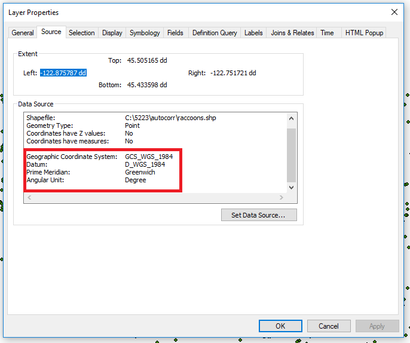
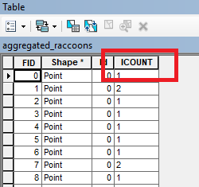
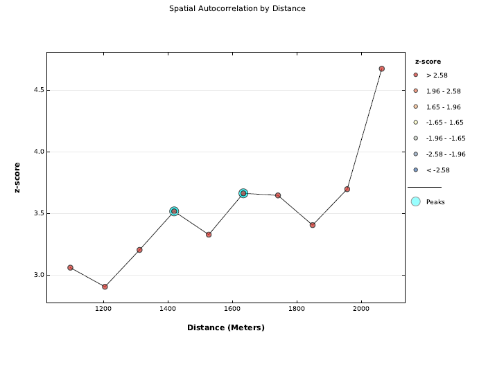

---
title: "GEG6230 Geostatistics"
author: Stuart Grieve
urlcolor: blue
colorlinks: true
...

# Hot spot analysis

## Aims and Objectives

In this practical you will be performing a series of analyses on a point dataset to identify statistically significant spatial patterns. We will be applying techniques discussed in the lecture, including Getis-Ord Gi*.  

By the end of this class you should be able to:

1. Prepare data for appropriate geospatial analysis
1. Generate visualisations of the spatial organisation of data
1. Identify a meaningful scale for an analysis
1. Interpret the results of Getis-Ord Gi* tests
1. Create a simple interpolated probability surface

## Data

Today's practical only requires one dataset, a point shapefile containing records of sightings of urban raccoons for an area of Portland, Oregon, USA. Datasets like these can be invaluable in the study of species distribution as well as providing insights into controls on wildlife populations.

Download the file `geostats_data.zip` from QMplus and extract it into a sensible location (either a folder or a GeoDatabase). The zip archive contains:

- `raccoons.shp` - A shapefile containing over 2000 sightings of raccoons in the first 5 months of 1998.

You may want to load a basemap using the drop down menu on the `Add Data` button, to see the observations in their geographical context. Bear in mind that this data is downloaded from the internet and can slow down navigation around the map.

## Projecting our data

When performing a geostatistical analysis, we need to consider how our data is projected. If we use a **geographic** coordinate system, which represents measurements as degrees, minutes and seconds, distances and areas are not constant across the dataset, which could impact the validity of our results. Instead, we want to use a **projected** coordinate system, which preserves areas and distances across a dataset.

We will start by checking what type of projection our data has. Load `raccoons.shp` using the `Add Data` button, and right click on the layer in the `Table of Contents` and select `Properties`. Choose the `Source` tab and scroll down until you reach the `Angular Unit` row. As you can see this is listed as `Degree`, which means we are using a geographic coordinate system.

 <!-- .element width="80%" -->

To reproject this data into a projected coordinate system we can use the `Project` tool, found in `ArcToolbox > Data Management Tools > Projections and Transformations > Project`. This tool requires the following parameters:

- `Input Dataset or Feature Class`: Our shapefile data (`raccoons.shp`)
- `Output Dataset or Feature Class`: The path and filename of the projected dataset
- `Output Coordinate System`: `NAD_1983_UTM_ZONE_10N`
- `Geographic Transformation`: `WGS_1984_(ITRF00)_To_NAD_1983`

After running the tool, add the new dataset to the table of contents, **and remove the original dataset** so we don't get things confused later.

## Aggregating data

Before we do anything else, we should make a backup copy of our projected shapefile, as some of the operations we will be performing will modify the dataset. This is always good practice when performing geospatial analyses, to ensure that you can always start again from scratch if things go wrong. Open `ArcCatalog` and create a copy of the projected data by right clicking on the shapefile, copying it and pasting it into the same folder. Rename the file with the suffix `_backup` so we know what it is.

Looking at the data, we can see that there are some apparent clusters in the data, with many points that are very close together. Due to the nature of this data, where people have reported sightings, giving the addresses in the attribute table, there is some uncertainty in their precise location. One way to overcome this is to aggregate points that are close together so that they overlap.

Open the `Integrate` tool, found in `ArcToolbox > Data Management Tools > Feature Class > Integrate` and select our projected raccoon data as the input feature. We now need to select an `XY Tolerance`, this is the maximum distance apart that two points can be for them to be integrated together. You need to select this value based on your understanding of the data, a good value in this case will be somewhere around 5 meters. Run the tool, and at first glance it may seem that not much has changed.

Load our backed up data and toggle between the backup and the integrated file to see all the small movements that have happened. You may need to zoom to fully see what has changed. **Now remove the backed up data from the table of contents**.

Now we can use the `Collect Events` tool, found in `ArcToolbox > Spatial Statistics Tools > Utilities > Collect Events`, to aggregate all overlapping points into a single point, scaled by the number of overlaps. Use our projected raccoon data as the input, and choose a sensible output name. Look at the table of contents for the new layer that is created when this tool is run:

 <!-- .element width="80%" -->

The `ICOUNT` field is a count of the number of overlapping points in a location, and by default ArcMap scales the size of the points based on this attribute, so we can begin to see some patterns emerge in the data.

**What areas seem to have the highest incidence of raccoon sightings?**

## Analysis scale

As we learned in the lecture, the scale over which we perform many analyses is important, and the scale choose can influence the results that we see. This is where our expert knowledge of the data comes in, and also the nature of the questions we are trying to answer. For example if we wish to understand where raccoons cluster in a city, we need to consider the typical distance raccoons may travel and any other spatial factors that may be driving the distribution of a phenomena we are studying. In reality this can be difficult to quantify, and there is rarely a 'right answer'.

One way that we can use the data to identify likely spatial scales, is to perform a series of Moran's I spatial autocorrelation tests and look at how the Z-scores change with distance. We could do this manually, but luckily ArcMap has a tool that automates this process, `Incremental Spatial Autocorrelation`, which can be found in `ArcToolbox > Spatial Statistics Tools > Analyzing Patterns > Incremental Spatial Autocorrelation`. The inputs are as follows:

- `Input Feature Class`: Our aggregated raccoon data
- `Input Field`: `ICOUNT`
- `Number of Distance Bands`: `10`, this is the number of Moran's I calculations that will be run.
- `Output Report File`: This is the output filename, which unlike anything we have done until now, is a pdf. Choose a sensible location and filename for this.

All of the other fields can be left as their defaults. After the tool has executed, navigate to the created pdf and open it. It should look something like this

 <!-- .element width="80%" -->

From this graph we can see that there is a peak in the Z-scores identified at around 1400 meters and another at 1700 meters.

## Getis-Ord Gi*

Now that we have identified a length scale, we can run a Getis-Ord Gi* test to identify statistically significant hot and cold spots in the data. This allows us to move beyond visual identification of clusters, and say something quantitative about the spatial distribution of our data.

The tool we use is called `Hot Spot Analysis (Getis-Ord Gi*)` and can be found in `ArcToolbox > Spatial Statistics Tools > Mapping Clusters > Hot Spot Analysis (Getis-Ord Gi*)`. The inputs for this tool are as follows:

- `Input Feature Class`: Our aggregated raccoon data
- `Input Field`: `ICOUNT`
- `Output Feature Class`: The path and filename of the result of our hot spot analysts
- `Conceptualization of Spatial Relationships`: `FIXED_DISTANCE_BAND`
- `Distance Method`: `EUCLIDEAN_DISTANCE`
- `Distance Band`: This is the distance we selected from our incremental spatial autocorrelation calculations.
- All other options can be left as their defaults.

The `Distance Method` indicates how we calculate distances between points, for other types of analysis it may be more appropriate to use `MANHATTAN_DISTANCE`, which calculates distance between points, following a grid, traveling at right angles, similar to how we navigate a city. We use `EUCLIDEAN_DISTANCE`, the straight line distance, in this case as we assume that raccoons will take the shortest path between two locations, cutting through gardens rather than following the road layout.

When the tool has completed, a new dataset will be loaded into your table of contents, with statistically significant hot spots coloured red, statistically significant cold spots coloured blue and the beige points are not statistically significant clusters.

**Look at the patterns in the data. Compare it to the aggregated data, where points were scaled by number of overlaps. What similarities or differences do you see between these two approaches?**

## Interpolating results

It can often be useful to visualise the results of a clustering analysis by interpolating a raster surface from the discrete point data. We will go into more detail on interpolation in ArcGIS in the next practical, but for now we will use Inverse Distance Weighting (IDW) to convert our point values into a surface. The tool we will use is called `IDW` and can be found in `ArcToolbox > Spatial Analyst Tools > Interpolation > IDW`. The inputs are as follows:

- `Input point features`: The output from the hot spot analysis
- `Z value field`: `GiZScore`
- `Output raster`: The path and filename of the interpolated raster file
- All other options can be left blank.

**Spend some time thinking about how to present this data, what would an appropriate colour scheme be? Does overlaying the point data on top of the surface help? Can you use transparency to show the basemap underneath?**
