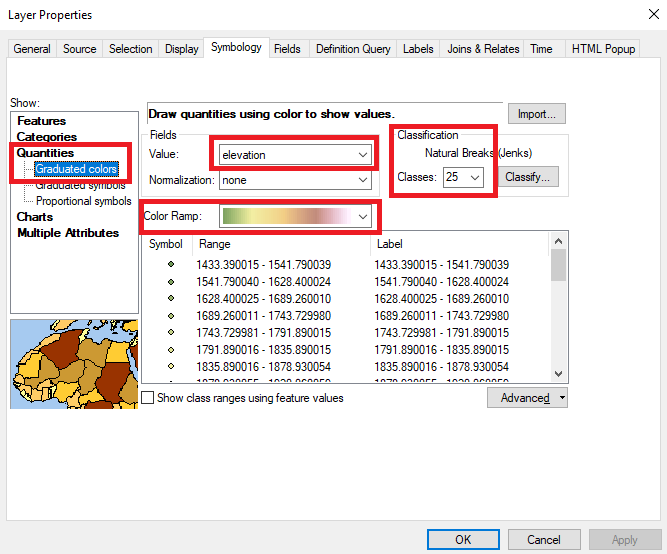
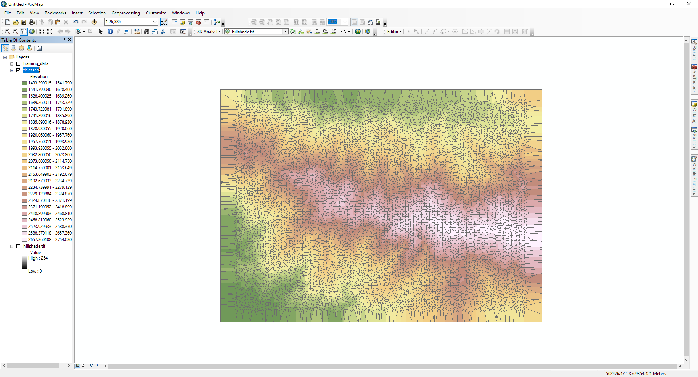
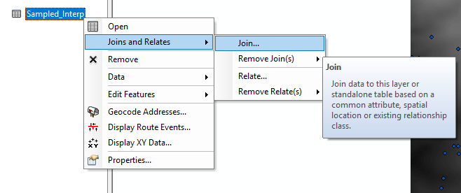
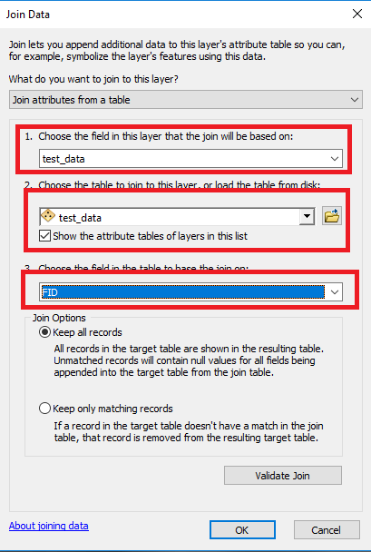
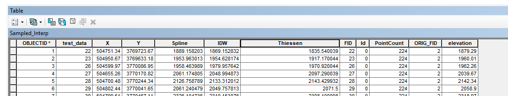
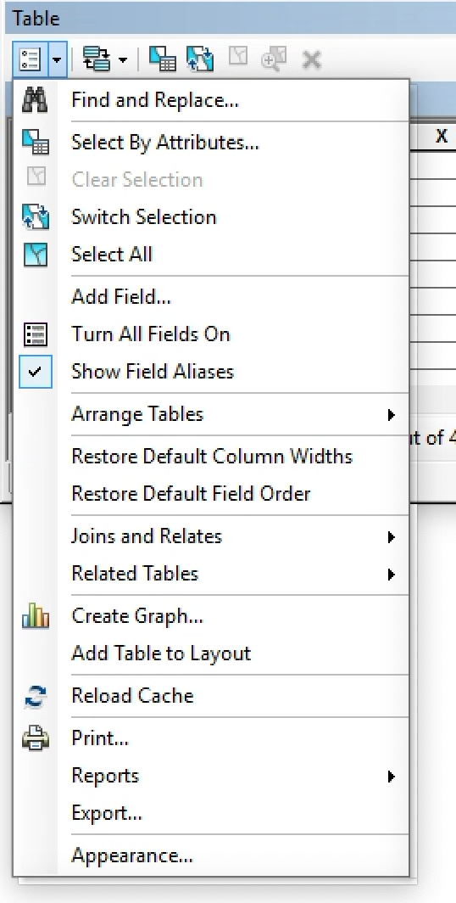
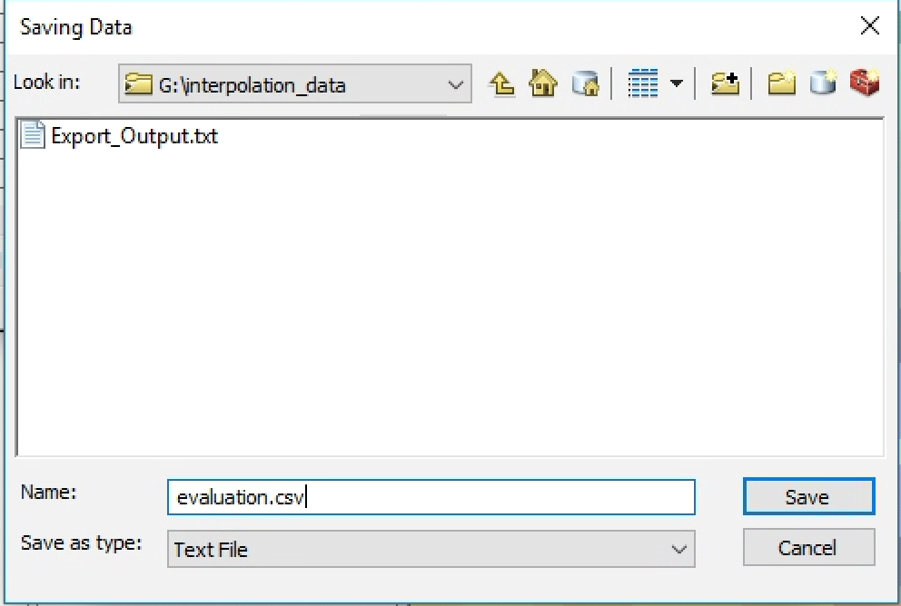
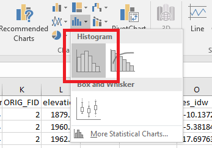

---
title: "GEG6230 Spatial Interpolation"
author: Stuart Grieve
urlcolor: blue
colorlinks: true
...

# Interpolation

## Aims and Objectives

In this practical you will be using some lidar point data from OpenTopography to explore a range of interpolation techniques, which were discussed in the lecture. We will also look at ways of evaluating the quality of these interpolations.

By the end of this class you should be able to:

1. Perform interpolation using the Thiessen polygon method
1. Perform interpolation using the IDW method
1. Perform interpolation using the spline method
1. Quantify the quality of each of these techniques

## Data

The data we are using today are two shapefiles of elevation values generated from topographic data provided by https://OpenTopography.org for the San Bernadino Mountains in California. The two shapefiles cover the same spatial area, one will be used for our interpolations, and the other will be used to evaluate those interpolations.

Note that in reality topographic data is rarely stored as point shapefiles due to the inefficiency of the file format. We have converted the data into this format as it is easier to use for ArcGIS's interpolation tools. Advanced Geospatial Science will return to this topic and look at other ways of interpolating topographic data.

Download the file `interpolation_data.zip` from QMplus and extract it into a sensible location (either a folder or a GeoDatabase). The zip archive contains:

- `training_data.shp` - A shapefile containing point elevation values for our study area.
- `test_data.shp` - A shapefile containing point elevation values for our study area, which can be used to evaluate our interpolated surface.
- `hillshade.tif` - A hillshade of a larger area of the San Bernadino Mountains, that can be used to obtain some context for the data we are studying.

There is an alternative file, `interpolation_data_small.zip`, provided on QMplus, which contains the above shapefiles, but not `hillshade.tif`. This can be used if you are on a slow internet connection.

### Visualising the data

Load the `training_data.shp` and `hillshade.tif` using the `Add Data` button. You can see that we have over 8000 lidar elevation values unevenly distributed across part of the landscape. Open the attribute table for `training_data.shp` and you will see that every point has an elevation value (in meters above sea level) recorded as an attribute. Note that the `Shape*` column describes the data as `Point ZM`, this means that the elevation values are also stored as part of the shapefile geometry. Unfortunately, some of the tools we will be using today do not support true three dimensional shapefiles, so we have the elevation values as an attribute for those cases.

We are first going to visualise the point data, by colouring the points by their elevation values. Open the `training_data.shp` `Properties` window by right clicking on the layer in the table of contents. Select the `Symbology` tab and choose `Quantities`. From here we can select the values we wish to display (Elevation in this case), choose an appropriate colour ramp and number of classes. The more classes you choose the smoother the transitions between colours will be.

 <!-- .element width="80%" -->

This helps us to see that there is a large ridge running across our dataset from east to west.

### Thiessen polygons

Our first interpolation will use Thiessen polygons to create polygons of constant elevation values around each of our points. To do this we will open the `Create Thiessen Polygons` tool, which can be found under `ArcToolBox > Analysis Tools > Proximity > Create Thiessen Polygons`. There are only three parameters for this tool, the input data is our `training_data.shp`, the `Output Feature Class` is the path and filename of the output Thiessen polygons, and we **must** set `Output Fields` to `ALL`, otherwise the elevation data will not be stored in each polygon. Once the tool has completed, it will load a new polygon dataset.

Zoom in to some of the data, and look at how each polygon has been 'grown' around each point. Does this look similar to what you saw in the lecture?

Lets use the same visualisation techniques as we did for the points to assign a colour to each polygon based on it's elevation value.

 <!-- .element width="80%" -->

Note that at the edges things always go a little odd for Thiessen polygons, so we are going to crop the edges so that we are only **interpolating** and not **extrapolating**. To do this we need to create a polygon around the outermost points in our dataset. This is known as a **convex hull**. Open the `Minimum Bounding Geometry` tool from `ArcToolBox > Data Management Tools > Features > Minimum Bounding Geometry` and fill in the following parameters:

- `Input Features`: This is our training data
- `Output Feature Class`: This is the path and filename of our output file
- `Geometry Type`: Set this to `CONVEX_HULL`
- Everything else can be left as the default

Once this tool has run, we will have a polygon dataset which outlines the limits of the interpolation we can perform. We can now use the `Intersect` tool, found in `ArcToolBox > Analysis Tools > Overlay > Intersect` to remove the bad data from the edges of our dataset, using the following parameters:

- `Input Features`: Select both the generated convex hull and the Thiessen polygon datasets
- `Output Feature Class`: This is the path and filename of our output file
- Everything else can be left as the default

Now, we want to convert these clipped polygons into a surface, using the `Polygon to Raster` tool, found in `ArcToolBox > Conversion > To Raster > Polygon to Raster`. Use the following parameters:

- `Input Features`: This is our clipped Thiessen polygons
- `Value field`: Choose `elevation`
- `Output Feature Class`: This is the path and filename of our output raster
- Everything else can be left as the default

Finally, create a hillshade of this new raster surface, so that we can compare it qualitatively to the provided hillshade of the whole landscape. **What are your first impressions? Is this a good way of interpolating elevation values? Why?**

### Inverse Distance Weighting (IDW)

We are now going to revisit the IDW tool that we used briefly in the last practical. The tool can be found in `ArcToolbox > Spatial Analyst Tools > Interpolation > IDW`. The standard inputs are as follows:

- `Input point features`: The training data
- `Z value field`: `elevation`
- `Output raster`: The path and filename of the interpolated raster file. **Must include the `.tif` file extension**
- `Output cell size`: This is the size of each cell in our output raster grid. Leave this as the default.

There are then a series of settings which we can adjust, which will alter the nature of the interpolated surface we create. The `Power` option, reflects the exponent on the distance value:

$$ Z_p = \frac{\sum_{i=1}^{n} \frac{Z_i}{d^2}}{\sum_{i=1}^{n} \frac{1}{d^2}}$$

In the lecture we saw that setting `Power` to `2` would preserve peaks in the surface, while using a value of `1` would smooth out the data.

The next parameter is the `Search radius`, which can be either `Variable` or `Fixed`. This controls the neighbourhood that we use to calculated the elevation value for each cell in our new raster grid. If we select `variable`, we can then select a number of points to be included in each IDW calculation. This means that the neighbourhood is smaller in areas of high point density and larger in less dense areas.

If we select `Fixed`, we can specify a `Distance`, which is the radius of the neighbourhood to be used across the whole dataset. If we choose a large value (100s of meters) we will include lots of points, smoothing out any local trends, but if we choose a much smaller value we will not have many points, resulting in a rougher surface.

Note that by default ArcMap applies a classified colour ramp to the outputs of our interpolations. It will be easier for you to interpret these surfaces by changing the symbology from `classified` to `stretched` in the layer's properties, in addition to generating a hillshade of each new surface.

Using all of these settings, create a series of different interpolated surfaces to explore how changing these parameters impacts the final result. Decide what set of parameters makes the best interpolation, when compared to `hillshade.tif`.

### Splines

Reminder from the lecture:

Regularised splines:
  - Smoother surface
  - High weight leads to smooth surface, ignoring more points

Tension splines:
  - Rougher surface
  - High weight creates 'stiffer' surface that passes through points more closely

The final interpolation method we will be using is the `Spline` tool, found in `ArcToolbox > Spatial Analyst Tools > Interpolation > Spline`, which has the following parameters:

- `Input point features`: The training data
- `Z value field`: `elevation`
- `Output raster`: The path and filename of the interpolated raster file. **Must include the `.tif` file extension**
- `Output cell size`: This is the size of each cell in our output raster grid. Leave this as the default.
- `Spline type`: Either `REGULARIZED` or `TENSION`
- `Weight`: a value ranging from 0.01 to > 50
- `Number of points`: The number of points included in each neighbourhood calculation. Default is 12.

As with the IDW interpolations performed in the last section, run several Spline interpolations, exploring how changing the spline type from `REGULARIZED` to `TENSION` and adjusting the weight and number of points impacts the resulting interpolated surface.

### Evaluating interpolations

In addition to the qualitative comparisons we have been making between the hillshaded interpolations, we can also employ some of the quantitative approaches to evaluation we discussed in the last lecture.

To perform a quantitative evaluation we can now load our test data (`test_data.shp`) that we have so far not used in our analysis, and so we know it is independent of what we have done so far.

To do this we are going to use the `Sample` tool, can be found in `ArcToolbox > Spatial Analyst Tools > Extraction > Sample`. This tool will extract the values of the given raster datasets and needs the following inputs:

- `Input rasters`: These are the values we will be sampling, so add our three interpolated rasters, one for each of our interpolation methods.
- `Input location raster or point features`: This is our test data.
- `Output table`: This is the filename of the output data.
- The other parameters do not need to be changed

There is one more step we need to perform before we can load our data into Python. We need to join the attributes of `test_data.shp` into the table we have just created, so that we have the actual elevation values in the same place as the elevations from our three interpolations.

Right click on the table created by the `Sample` tool, and select `Joins and Relates > Join`:

 <!-- .element width="80%" -->

Complete the options as shown in the image:

 <!-- .element width="80%" -->

which will link the attributes to the new table based on the unique `FID` field within `test_data.shp`. After this has completed, open the attribute table and check that you now have a table containing the elevation values from `test_data.shp` alongside the 3 interpolated elevation values.

 <!-- .element width="80%" -->

We can now export our spatially joined data as a `csv` file that we can load using Python for further analysis. Open the Table we have just done the join on, and click on the `Table Options` button in the top left of the window:

 <!-- .element width="80%" -->

Select `Export...` and choose where to save the data, ensuring that you change the file type to `Text file` and you choose a sensible filename such as `evaluation.csv`:

 <!-- .element width="80%" -->

<!--

Right click on the joined table in the Table of Contents, and select `Data > Export`. Give a sensible filename to the exported data and **Make sure that you give this file the `.dbf` extension, or it will not load into Excel!**

Load this file in Excel, and save it as a proper Excel workbook, to ensure that you do not lose any data. The we now need to calculate our residuals, this is done by taking the interpolated measurement and subtracting the elevation from `test_data.shp` from it. Create three new columns your residuals for each interpolation type.

Once you have each column of residuals, you can plot them as a histogram using the histogram tool:

 <!-- .element width="80%" -->

<!--
**What patterns can you see in these histograms? Are the errors the same for each interpolation method? Are they biased towards over or under estimates?** -->
